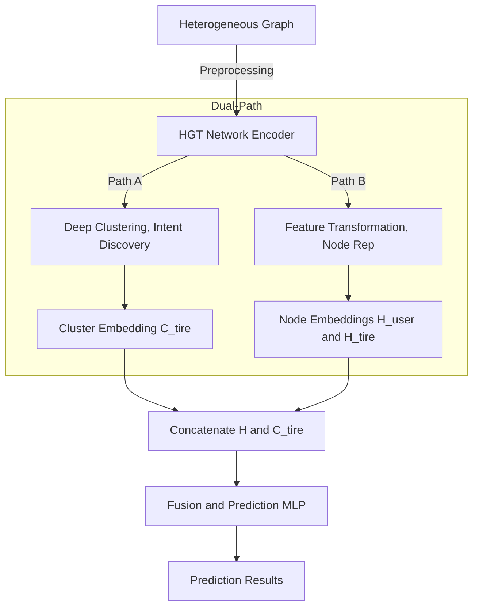
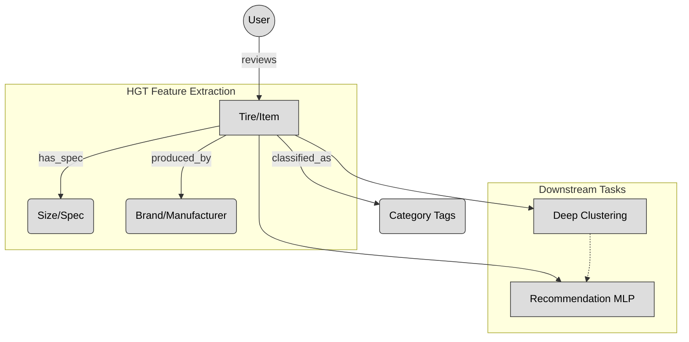

# GNN-based Tire Recommendation System  

An advanced, GNN-based tire recommendation engine that transcends traditional collaborative filtering by deploying **Heterogeneous Graph Neural Networks (HGT)**, **Deep Embedding Clustering**, and **Contrastive Learning**. It is specifically designed to decode complex user feedback, isolate hidden complaint patterns, and deliver highly contextual, complementary product recommendations.

---

## System Architecture

### Heterogeneous Graph Schema
To fully leverage **HGT**, tires are not treated as isolated points; instead, we construct a rich, interconnected network mapping out interactions and specifications.

- **Node Types**:
    - `User`: Contains user attributes (e.g., `user_id`).
    - `Tire/Item`: Contains continuous/categorical features (e.g., `price`, `average_rating`, `UTQG`).
    - `Brand`: Captures brand loyalties and preferences (e.g., "Michelin", "Landspider").
    - `Size`: The most critical node for tire recommendation (e.g., "235/40R18"). Tires with the same specifications are naturally clustered through this node.
- **Edge Types (Meta-Relations)**:
    - `User -[reviews]-> Tire`: Weighted by the review rating.
    - `Tire -[belongs_to]-> Brand`: Brand affiliation.
    - `Tire -[has_spec]-> Size`: Specification grouping.

### Feature Extraction Layer (HGT Encoder)
The **HGT Network** addresses the graph's heterogeneity by dynamically learning the importance of different meta-relations (e.g., recognizing that "Size" often carries a higher weight than "Brand").
- **Output:** High-dimensional Node Embeddings ($h_{user}$ and $h_{tire}$).
- **Advantage:** HGT automatically uncovers deep latent associations, such as learning that "a specific sized tire is vastly more popular within a certain brand."

### Intermediate Layer: Dual-Path Processing
This is the core architectural optimization of the system. The pipeline splits into two synchronized branches:
- **Path A: Deep Clustering (Intent Discovery):** Feeds $h_{tire}$ into a clustering MLP to automatically categorize tires into distinct profiles, such as "Economy/High-Mileage," "Performance/Sport," or "Off-Road/All-Terrain."
  - **Output:** Cluster probability distributions or definitive group labels ($C_{tire}$).
- **Path B: Feature Transformation:** Applies non-linear transformations to the raw user and tire representations ($h_{user}$ and $h_{tire}$) to prepare them for dense vector matching.

### Output Layer: Fusion & Prediction MLP
This final layer acts as the confluence point, aggregating all information to generate the final recommendation.

$$ \text{Final Prediction} = \text{MLP}(\underbrace{h_{user} \oplus h_{tire}}_{\text{Individual Features}} \oplus \underbrace{C_{tire}}_{\text{Cluster Group Features}}) $$
- **Results:** 
  1. **Recommendation Score:** Predicts the user's expected rating or the probability of purchase for the specific tire.
  2. **Cluster Tagging:** Utilized for backend analytics and user profiling (e.g., building a user persona that strongly favors the "Budget" cluster).

### 📊 System Flowchart

---

## Data Schema

